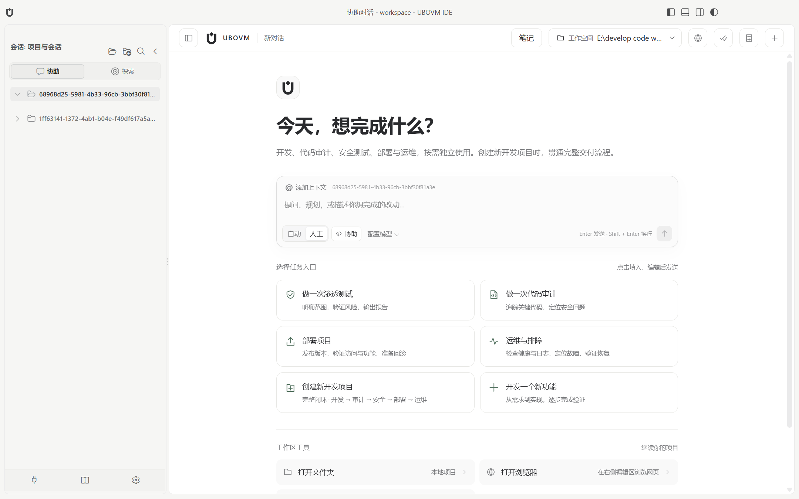
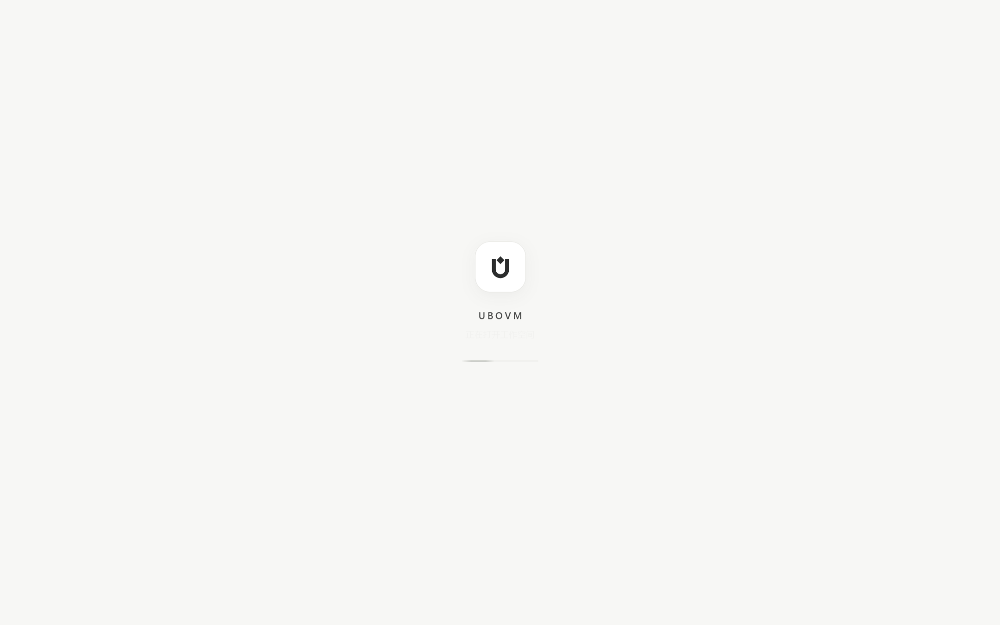
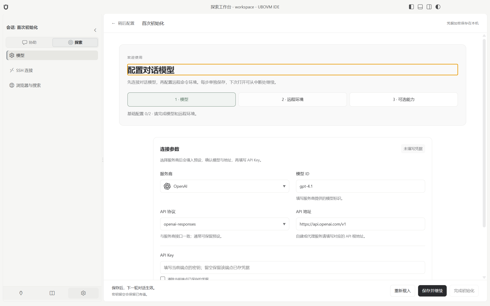
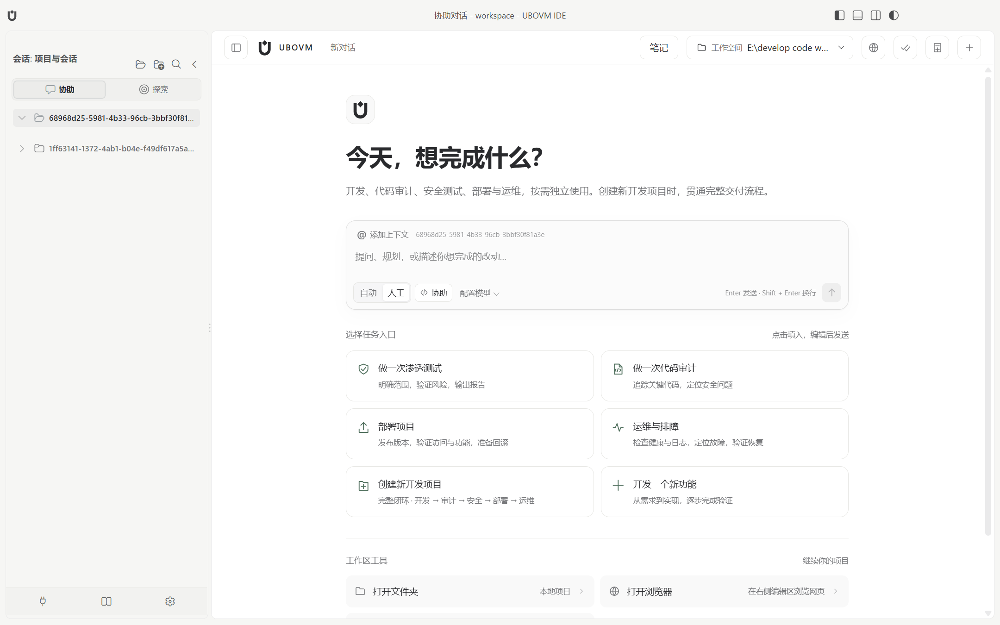
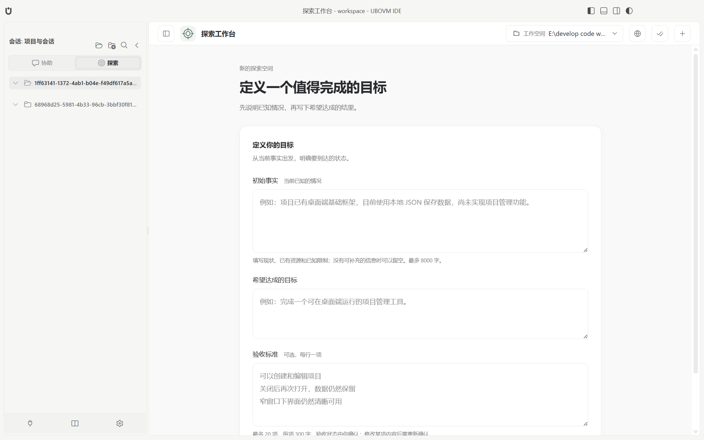

<p align="center">
  
</p>

<h1 align="center">UBOVM</h1>

<p align="center"><strong>面向渗透测试、CTF、代码审计与编码的桌面 IDE</strong></p>

<p align="center">
  把编辑器、远程 Linux、浏览器和 Agent 放在同一窗口。<br>
  工作台基于 VS Code / Code OSS；任务由内置 Agent 运行时执行、落证据、可审批。
</p>

<p align="center">
  
  &nbsp;协助对话&nbsp;·&nbsp;探索黑板&nbsp;·&nbsp;SSH 优先&nbsp;·&nbsp;人工审批
</p>

<p align="center">
  
</p>

UBOVM 不是在编辑器里外挂一个聊天框。主对话常驻中间，左侧是项目与会话，右侧是当前会话的文件树和原生编辑器。Agent 可以直接读代码、改文件、在远程 Linux 上跑命令、打开内置浏览器，并把工具输出、漏洞候选和 diff 留在同一会话里。

明确的 CTF / 授权安全任务默认视为赛题范围：优先使用已配置的 **远程 Linux SSH** 做侦察、验证与拿 flag；本机 Shell 只用于看代码、改代码和搭环境。授权不会延伸到无关的真实系统。

---

## 品牌

| | |
| --- | --- |
|  | **应用图标**：深绿色圆角底，浅色 U 形工作空间与悬浮菱形（智能核心）。窗口、安装包与欢迎页共用此标。源文件 `src/renderer/media/app-icon.svg`。 |
|  | **单色标志**：跟随主题前景色，用于启动页、对话页头和侧栏。源文件 `src/renderer/media/icon.svg`。 |

<p align="center">
  
</p>

<p align="center"><em>启动画面与产品标志一致，工作台就绪后淡出。</em></p>

界面截图来自本机启动的真实 UBOVM 窗口。重新拍摄：`node docs/preview/capture-desktop.mjs`。应用图标：`node resources/branding/generate-icons.mjs`。

---

## 它是怎样一个 IDE

```text
┌────────────┬──────────────────────────┬────────────┐
│ 项目与会话  │  主对话（常驻，不可关）     │  文件编辑   │
│ 协助 / 探索 │  模型 · 审批 · 工作空间    │  文件树     │
└────────────┴──────────────────────────┴────────────┘
                    本机 / SSH 终端
```

| 模式 | 做什么 |
| --- | --- |
| **协助** | 提问、改代码、审计模块、解题对话；输入队列、本轮 diff 与撤销 |
| **探索** | 带目标与验收的长任务：攻击面、多 Worker、黑板事实与笔记 |

首次打开会引导配置模型和 SSH。密钥进系统凭据库，页面里只显示是否已配置。SSH 主机是**执行环境**，不等于题目目标；地址和端口以任务证据为准。

<p align="center">
  
</p>

---

## 渗透测试

把授权范围内的 Web / 主机测试做成可追踪的工作流，而不是一串散落的终端记录。

<p align="center">
  
</p>

- **远程 Linux 优先**：侦察、枚举、扫描、探测、漏洞验证走 `run_linux_ssh_command`。命名会话可保留工作目录与环境变量；长命令可中断或放到后台，停止本轮对话不会误杀驻留进程。
- **攻击面台账**：`domain_inventory` 从种子域展开子域、证书 SAN、DNS 别名、HTTP 跳转。由种子关联出的主机默认在范围内；覆盖未完成，不能当作安全阶段已验收。
- **浏览器与被动情报**：内置浏览器打开页面、抓 DOM；`fetch_web_content` / `web_search` 做公开内容检索。需要落地验证时再上远程命令行，而不是用本机 Shell 冒充远端。
- **带外检测**：Skills 可接 ceye.io 一类 DNSLog，用于盲 SSRF、XXE、命令注入、SQL 注入等无回显场景。
- **资产与漏洞笔记**：笔记区分普通记录、资产、漏洞候选（目标、向量、严重级别、证据、利用链提示）。候选不是已确认 Finding；可提升到探索黑板。
- **人工审批**：默认每次工具调用先「允许一次 / 拒绝」。高风险命令出现在对话里，看得见再执行。

独立渗透或审计任务不必走「新开发项目」交付台账。交付闭环只用于开发 → 审计 → 安全 → 部署 → 运维的阶段验收。

---

## CTF

针对题目分析、利用调试和 flag 核验。

- **赛题范围**：题目文件、本地环境和指定靶机视为已授权。Agent 不会反复追问权限，也不会插入套话式免责声明。
- **默认远程解题**：枚举、端口、漏洞验证、payload、取 flag 优先在 SSH 的 Linux 上完成。附件用 SFTP 送上去；不要假设本机路径在远端存在。
- **本地只做配套**：工作区打开附件、写脚本、注释逆向结果；Python 沙箱跑加解密、编码和协议草稿。
- **证据链**：工具输出进时间线。探索模式用黑板记录事实、意图、待补证，可以顺着证据往上或往下走。
- **协作**：主 Agent 可派 Worker 分头看附件、写脚本、在远端验证，日志仍归同一会话。

SSH 不可用或缺工具时会说明具体限制，并改用允许的替代路径，不会把远端操作偷偷改成本机扫描。

---

## 代码审计

在原生编辑器里读项目，审查结果必须带位置和证据。

- **只读检索**：工作区 ripgrep、按文件分页读代码、语言服务诊断。编译检查是受限的 no-emit，不执行用户脚本。
- **结构导航**：跳转定义、调用链、重命名预览；项目说明（如 `AGENTS.md`）随读取注入。
- **选区进对话**：编辑器选中代码可附加到当前会话，提交用当时的快照。
- **发现要落盘**：漏洞候选必须带 effects 与 evidence；删除笔记要写原因。
- **和渗透衔接**：审计假设用远程命令或浏览器再验证；修复走编码工具，本轮 diff 可复查、可撤销。

对着单个模块用协助；「覆盖这些路由 / 清掉高危」这类带验收的任务用探索。

---

## 编码

原生编辑器改代码，Agent 的写入可追踪、可撤销。

- **精确编辑**：先读文件再按内容 hash 创建、替换、多处 patch 或按范围修改；也可一次预览最多 20 个文件再提交。
- **本轮变更**：回复下方汇总增删行，点文件名打开原生 diff，可一键撤销本轮工作区 UTF-8 修改（不含 SSH / 终端 / Python 的副作用）。
- **本机开发循环**：`run_local_shell_command` 只用于检查、构建、测试、调试和装依赖（Windows 为 PowerShell）。`npm run dev` 可驻留。
- **Python**：内置解释器在沙箱里跑脚本、管依赖，不改系统 Python。
- **验证**：保存前记诊断基线，改完再检查。Agent 不能把「文件已写入」说成「测试已通过」。
- **新项目交付**（可选）：开发 / 审计 / 安全 / 部署 / 运维分阶段验收；安全和部署必须引用真实执行证据。

本地 Shell 不能用来做通用浏览、绕过远程工具限制，或把渗透步骤改在本机执行。

---

## 探索工作台

长任务需要目标、验收和并行 Worker 时，切到探索模式。

<p align="center">
  
</p>

- **概览**：目标、验收进度、思考与调度日志
- **黑板**：事实 / 意图图，可搜索、追溯上游证据或追踪下游分支
- **任务**：Worker 列表与执行记录（也可在右侧原生 Worker 日志面板查看）
- **笔记**：资产、漏洞候选与过程记录，可提升到黑板

运行中可以切换会话，后台仍写回原来的会话；切走不会中断执行，也不会误批其他会话的工具。

---

## 开始使用

### 安装包

Windows x64 安装后启动 `UBOVM.exe`。用户数据在 `~/.ubovm/desktop/`。

### 从源码启动

需要 **Node.js 24**（`< 25`）。Windows 使用 PowerShell；macOS / Linux 需要 PowerShell 7（`pwsh`）。

```sh
npm install
node build.mjs setup    # 下载并准备桌面运行时
node build.mjs start    # 启动 IDE
```

建议顺序：

1. 配置 **模型**（服务商、模型 ID、API 地址；密钥进系统凭据库）
2. 配置 **SSH**（CTF / 渗透的默认远程执行环境）
3. 按需打开浏览器、搜索、DNSLog、MCP、Skills

开发界面用 `node build.mjs dev`。其它动作见 `node build.mjs help`。

### 常用快捷键

| 操作 | 快捷键 |
| --- | --- |
| 聚焦主对话 | `Ctrl+L` |
| 新建对话 | `Ctrl+Shift+L` |
| 快速打开文件 | `Ctrl+P` |
| 工作区查找 / 替换 | `Ctrl+Shift+F` / `Ctrl+Shift+H` |

---

## 数据与边界

| 内容 | 位置 |
| --- | --- |
| 配置、会话、凭据 profile | `~/.ubovm/desktop/` |
| 默认会话工作空间 | `~/.ubovm/workspace/` |
| 跨会话学习库 | `~/.ubovm/learning/` |

- API Key 不进对话页面
- 工作区文件工具受目录边界与 realpath 约束
- 对话 Markdown 使用白名单渲染，不自动请求远程图片
- 审批、停止、删除以**当前会话**为界
- 题目文件和工具输出都是不可信证据，不能自行扩大范围

后台会把工具执行经验写入学习库，供后续任务参考；经验不能扩大权限，也不能代替当前任务的验收。

---

## 仓库

```text
src/main/          Electron 入口、数据目录、Python 运行时
src/renderer/      工作台扩展、对话页面、主题与产品图标
src/harness/       Agent SDK、协作、探索调度、内置工具
docs/images/       README 使用的标志与界面图
resources/         品牌生成、工作台补丁、运行时清单
vendor/vscode/     Code OSS 内核
```

工作台扩展（`src/renderer`）为 MIT。桌面内核遵循 VS Code / Code OSS 许可。
